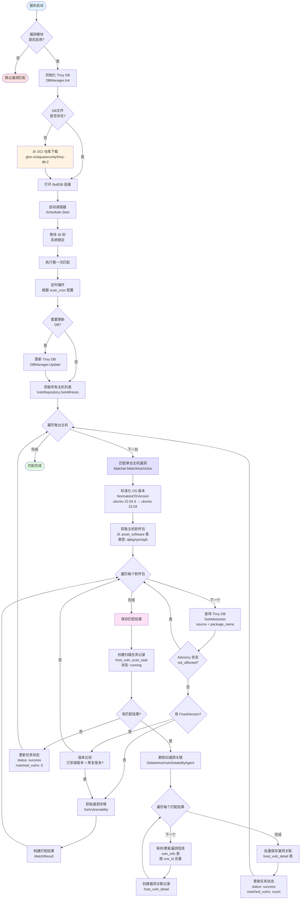

# 主机漏洞匹配流程

## 概述

主机漏洞匹配是一个定时任务，通过将主机上安装的软件包与 Trivy 漏洞数据库进行匹配，识别存在漏洞的软件包。

## 完整流程图



## 详细流程说明

### 1. 初始化阶段（服务启动时）

**位置**: `cmd/main.go` 第 91-104 行

```go
if cfg.Vuln.Enabled {
    vulnDBManager := vuln.NewDBManager(&cfg.Vuln)
    vulnDBManager.Init(context.Background())
    vulnScheduler = vuln.NewScheduler(&cfg.Vuln, vulnDBManager)
    vulnScheduler.Start()
}
```

**步骤**:
1. 检查配置：`vuln.enabled` 是否为 `true`
2. 创建 DBManager：管理 Trivy 漏洞数据库
3. 初始化数据库：
   - 如果本地不存在 DB 文件，从 OCI 仓库下载
   - 打开 BoltDB 连接
4. 创建调度器：`Scheduler` 负责定时执行匹配
5. 启动调度器：解析 cron 表达式，启动定时任务

### 2. 定时调度阶段

**位置**: `internal/vuln/scheduler.go` 第 54-79 行

**触发时机**:
- 服务启动后延迟 30 秒执行第一次匹配
- 之后根据 `scan_cron` 配置定时执行（默认每天凌晨2点）

**执行流程**:
```go
executeMatchAll() {
    1. 检查并更新漏洞数据库（如果需要）
    2. 执行主机漏洞匹配：matchAllHosts()
    3. 执行镜像漏洞匹配：matchAllImages()
}
```

### 3. 主机漏洞匹配阶段

**位置**: `internal/vuln/matcher.go` 第 46-86 行

#### 3.1 获取主机列表
- **数据源**: `asset_host` 表
- **查询**: `VulnRepository.GetAllHosts()`
- **字段**: `agent_id, host_name, host_ip, os_type, os_version`

#### 3.2 标准化 OS 版本
- **函数**: `NormalizeOSVersion(osType, osVersion)`
- **目的**: 将 OS 版本转换为 Trivy DB 的 source 格式
- **示例**:
  - `Ubuntu 22.04.3 LTS` → `ubuntu 22.04`
  - `Debian GNU/Linux 12` → `debian 12`
  - `CentOS Linux 7.9` → `centos 7`

#### 3.3 获取软件包列表
- **数据源**: `asset_software` 表
- **查询**: `VulnRepository.GetHostPackages(agentID)`
- **过滤条件**: `type IN ('dpkg', 'rpm', 'apk')`
- **字段**: `name, version, type`

#### 3.4 匹配软件包漏洞
**位置**: `internal/vuln/matcher.go` 第 115-190 行

对每个软件包执行以下步骤：

1. **查询 Advisory**
   ```go
   advisories := dbMgr.GetAdvisories(source, packageName)
   ```
   - 从 Trivy DB 查询该软件包在该 OS 版本下的所有漏洞 Advisory

2. **过滤处理**
   - 跳过状态为 `not_affected` 的 Advisory
   - 去重：`cve_id + package_name` 组合

3. **版本比较**（如果有 FixedVersion）
   ```go
   versionLessThan(pkgType, installedVersion, fixedVersion)
   ```
   - **dpkg**: 使用 `go-deb-version` 库
   - **rpm**: 使用 `go-rpm-version` 库
   - **apk**: 使用 `go-deb-version` 库（近似）
   - 如果 `已安装版本 >= 修复版本`，则不受影响，跳过

4. **获取漏洞详情**
   ```go
   vulnerability := dbMgr.GetVulnerability(cveID)
   ```
   - 从 Trivy DB 获取 CVE 的详细信息
   - 提取：标题、描述、CVSS 分数、严重等级、参考链接

5. **构建匹配结果**
   ```go
   MatchResult {
       CveID, VulnName, Severity, CvssScore,
       PackageName, InstalledVersion, FixedVersion,
       Description, References
   }
   ```

### 4. 结果保存阶段

**位置**: `internal/vuln/matcher.go` 第 231-329 行

#### 4.1 创建扫描任务记录
- **表**: `host_vuln_scan_task`
- **初始状态**: `ScanStatusRunning` (0)
- **字段**: `agent_id, host_name, host_ip, scan_time, total_packages`

#### 4.2 清理旧数据
- **操作**: `DeleteHostVulnDetailsByAgent(agentID)`
- **目的**: 删除该主机之前的漏洞关联记录（避免重复）

#### 4.3 保存漏洞信息
- **表**: `vuln_info`
- **去重策略**: 按 `cve_id` 唯一索引
- **操作**: `CreateOrUpdateVulnInfo()` - 如果存在则更新，不存在则创建

#### 4.4 批量保存漏洞关联
- **表**: `host_vuln_detail`
- **操作**: `BatchCreateHostVulnDetails()` - 批量插入
- **关联关系**:
  - `scan_id` → `host_vuln_scan_task.id`
  - `vuln_id` → `vuln_info.id`
  - `agent_id` → 主机标识

#### 4.5 更新任务状态
- **状态**: `ScanStatusSuccess` (1)
- **更新字段**: `matched_vulns, scan_duration`

## 数据表结构

### 1. asset_host（主机资产表）
- 存储主机基本信息
- 字段：`agent_id, host_name, host_ip, os_type, os_version`

### 2. asset_software（软件包资产表）
- 存储主机上安装的软件包
- 字段：`agent_id, name, version, type` (dpkg/rpm/apk)

### 3. host_vuln_scan_task（扫描任务表）
- 记录每次扫描任务
- 字段：`agent_id, host_name, host_ip, scan_status, total_packages, matched_vulns, scan_time`

### 4. vuln_info（漏洞信息表）
- 存储漏洞基本信息（按 CVE ID 去重）
- 字段：`cve_id, vuln_name, severity, cvss_score, description, fix_suggestion`

### 5. host_vuln_detail（主机漏洞关联表）
- 记录主机上发现的漏洞
- 字段：`scan_id, agent_id, vuln_id, cve_id, package_name, installed_version, fixed_version, status`

## 关键配置

### server.yaml 配置示例

```yaml
vuln:
  enabled: true                    # 是否启用漏洞扫描
  db_dir: /opt/cloudsec/server/data/trivy-db  # 漏洞数据库存储目录
  db_repository: "ghcr.io/aquasecurity/trivy-db:2"  # OCI 仓库地址
  update_interval: 24              # 数据库更新间隔（小时）
  scan_cron: "0 2 * * *"          # 定时扫描 cron 表达式（每天凌晨2点）
```

## 版本比较逻辑

### dpkg (Debian/Ubuntu)
- 使用 `go-deb-version` 库
- 支持 epoch、版本号、后缀（如 `1:2.3.4-1ubuntu1`）

### rpm (CentOS/RHEL)
- 使用 `go-rpm-version` 库
- 支持版本号比较

### apk (Alpine)
- 使用 `go-deb-version` 库（近似）
- 如果版本完全相同，视为不受影响

## 注意事项

1. **数据依赖**: 需要 Agent 先上报软件包数据到 `asset_software` 表
2. **OS 版本要求**: 主机必须有有效的 `os_type` 和 `os_version` 信息
3. **软件包类型**: 只匹配 `dpkg`、`rpm`、`apk` 类型的软件包
4. **数据库更新**: Trivy DB 会根据配置自动更新
5. **性能考虑**: 匹配是批量操作，可能耗时较长，建议在低峰期执行

## 手动触发

除了定时任务，也可以通过 HTTP API 手动触发：

```bash
POST /api/vuln/scan/trigger
```

这会调用 `Scheduler.RunOnce()` 立即执行一次匹配。
